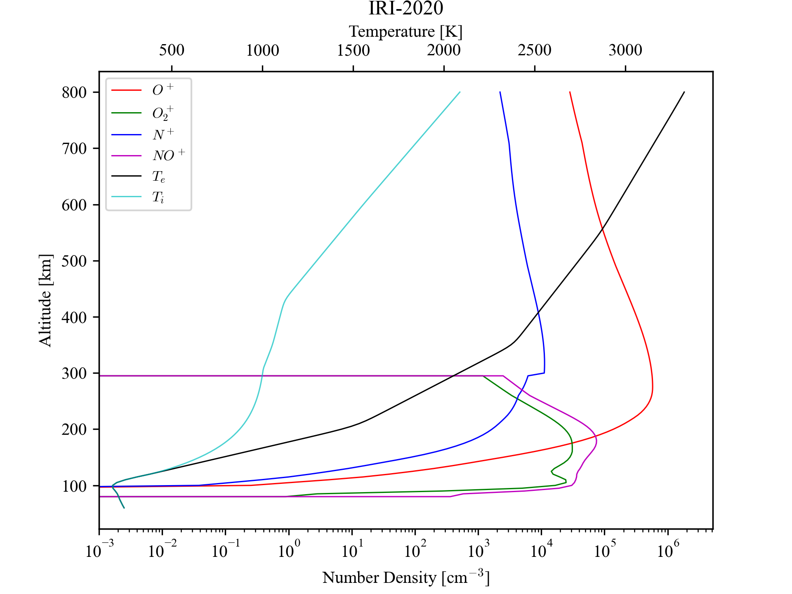

[](https://zenodo.org/badge/latestdoi/1089134543)
# IRI-2020 Python Wrapper
`iri20py` is a wrapper around the [IRI-2020](https://ccmc.gsfc.nasa.gov/models/IRI~2020/) empirical model.

This repository includes a version of the IRI-2020 model where the call signatures have been modified for
ease of integration with Python. The integration is achieved by means of a FORTRAN shim ([`irishim.f90`](src/IRI2020/irishim.f90))
that is compiled into a module using [F2PY](https://numpy.org/doc/stable/f2py/index.html). Data files
associated with IRI-2020 are included in the [`data`](src/IRI2020/data) folder and are available at
runtime. The wrapper automatically retrieves the latest available [`ig_rz.dat`](https://chain-new.chain-project.net/echaim_downloads/ig_rz.dat)
and [`apf107.dat`](https://chain-new.chain-project.net/echaim_downloads/apf107.dat) files on import.

## Prerequisites
A Fortran compiler is **REQUIRED**.
### Linux
Ensure that you have the following development packages installed:
- `build-essential` (for `gcc`, `g++`, `make`, etc.)
- `gfortran` (Fortran compiler)
### macOS
Ensure that you have the Xcode Command Line Tools installed. You can install them by running:
```sh
xcode-select --install
```
Install [`homebrew`](https://brew.sh/) if you haven't already, and then install `gfortran`:
```sh
brew install gfortran
```
<b>Note:</b> For macOS Big Sur and above, you may need to add the following line to your environment script (`~/.zshrc` if using ZSH, or the relevant shell init script):
```sh
export LIBRARY_PATH="$LIBRARY_PATH:/Library/Developer/CommandLineTools/SDKs/MacOSX.sdk/usr/lib"
```
Then reopen the terminal. This fixes the issue where `-lSystem` fails for `gfortran`.
 
### Windows (amd64 or x86_64 targets)
On Windows, MSYS2 is the preferred distribution for installing the Fortran compiler toolchain (for GNU Compiler Collection).
- Install [MSYS2](https://www.msys2.org/).
  Note the directory where MSYS2 was installed (defaults to `C:\msys64`) [referred to as `MSYS_INSTALL_DIR`].
  It is not recommended to change this directory.
- Launch the MSYS2 terminal (MSYS2 MSYS application on the start menu)
- Update MSYS2 environment (assuming fresh install):
  ```sh
  pacman -Syu # Restart the terminal
  pacman -Su  # Update packages
  ```
- Install the GNU Compiler Collection:
  ```sh
  pacman -S --needed base-devel mingw-w64-ucrt-x86_64-toolchain mingw-w64-ucrt-x86_64-gcc-fortran
  ```
- Add `MSYS_INSTALL_DIR\ucrt64\bin` (defaults to `C:\msys64\ucrt64\bin`) to `PATH`:
  - Search for `env` in the Start menu,
  - Select "Edit the system environment variables",
  - Click "Environment Variables",
  - Double click 'Path' under 'User variables for USER'
  - Click "New"
  - Type in, or paste the full path to `ucrt64\bin` (defaults to `C:\msys64\ucrt64\bin`)
  - Click "Ok" on the environment variable windows to save the changes.
- Continue with installation instructions for the Python packages below, in a new, regular terminal (e.g. Command Prompt or PowerShell with Python installed).

> [!NOTE] 
> Change the toolchain names accordingly for Windows arm64.
> This platform has not been tested and is not officially supported.

## Installation

### From [PyPI](https://pypi.org/project/iri20py/)
```sh
pip install iri20py
```
### From [GitHub](https://github.com/sunipkm/iri20py)
```sh
pip install iri20py@git+https://github.com/sunipkm/iri20py
```

## Usage
### Quick Test
On the command line, execute `Iri20Test`.
This should produce a plot of noon and midnight electron density profiles.

### Python

```py
from iri20py import Iri2020, alt_grid
from datetime import datetime, UTC
import matplotlib.pyplot as plt

# Instantiate the model
iri = Iri2020()
# Note: iri is a singleton (thread safety with FORTRAN)
# Evaluate the model
_, ds = iri.evaluate(
    datetime(2022, 3, 12, 0, 0, 0, tzinfo=UTC),
    40, -70,
    alt_grid()
)

# ds is an xarray Dataset
# Plot electron density profile
ds.Ne.plot(y='alt_km')
plt.show()
```

## Output Dataset Format
- Coordinates
  - Altitude (`alt_km`): Altitude in *km*
- Data Variables (as a function of altitude)
  - Electron density (`Ne`) in *cm*<sup>-3</sup>
  - Electron temperature (`Te`) in *K*
  - Ion temperature (`Ti`) in *K*
  - O<sup>+</sup>, H<sup>+</sup>, He<sup>+</sup>, O<sub>2</sub><sup>+</sup>, NO<sup>+</sup>, N<sup>+</sup> and cluster ion densities (*cm*<sup>-3</sup>)
- Attributes
  - `settings`: JSON string of settings (`iri20py.Settings`) used to evaluate the model.
  - `date`: ISO formatted date and time for which the model was evaluated.
  - `lat` and `lon`: Latitude and longitude for where the model was evaluated.
  - Additional attributes as returned in the `OARR` struct (refer to IRI-2020 documentation).
    These additional attributes are provided as JSON dictionaries containing a `value`, its `unit`,
    a longer name (`long_name`) and an associated `description`, if available.

The dataset is NetCDF4 compatible.

## Example Plot
An example script to generate the following plot is available in the
[`tests/test_iri2020.py`](tests/test_iri2020.py) file.


# Citation
If you use this code in your work, please cite the repository:
```bibtex
@software{sunipkm_iri20py_2025,
  author       = {Sunip K. Mukherjee},
  title        = {{iri20py}: A Python Wrapper for the IRI-2020 Empirical Model},
  month        = nov,
  year         = 2025,
  publisher    = {GitHub},
  version      = {v0.0.2},
  doi          = {https://zenodo.org/badge/latestdoi/1089134543},
  url          = {https://github.com/sunipkm/iri20py},
}
```